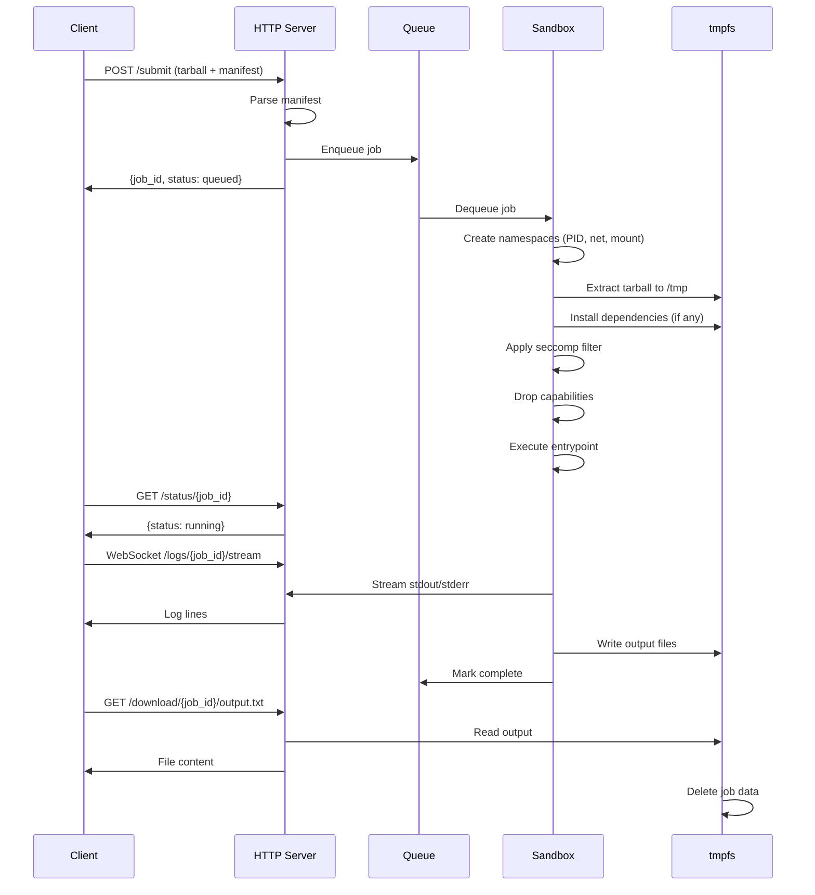
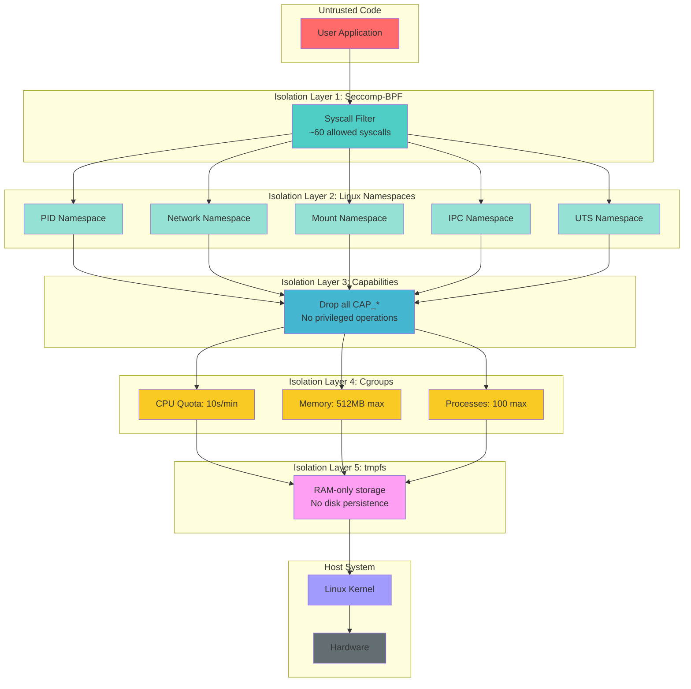
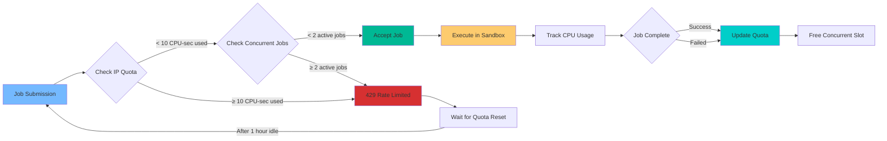
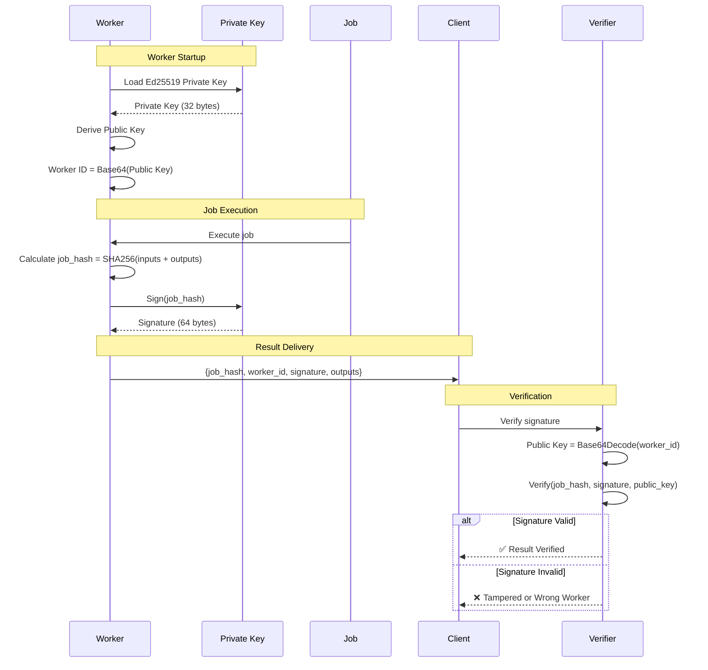
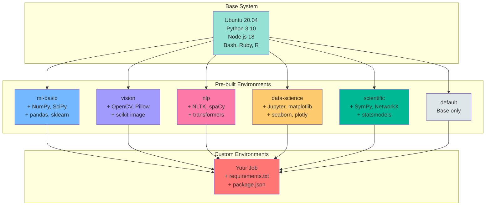
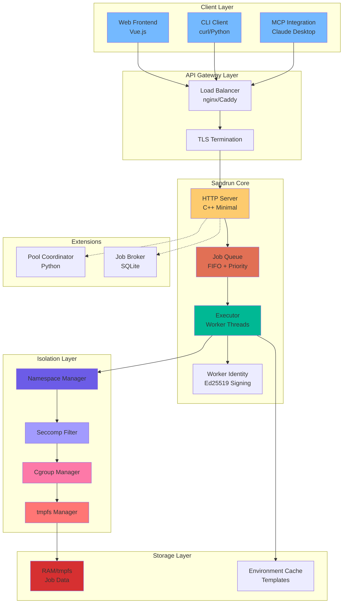
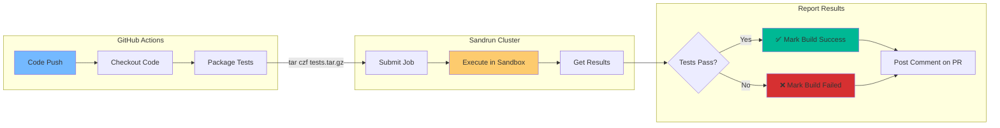

# Visual Diagram Suggestions for Sandrun Documentation

This document provides specific suggestions for diagrams that would enhance the documentation.

## Priority 1: Essential Diagrams

### 1. Job Execution Flow

**Location:** `/docs/architecture.md` and `/docs/getting-started.md`

**Purpose:** Show complete lifecycle of a job from submission to cleanup

**Suggested Mermaid Code:**


### 2. Security Isolation Layers

**Location:** `/docs/security.md` and `/docs/architecture.md`

**Purpose:** Visual representation of defense-in-depth layers

**Suggested Mermaid Code:**


### 3. Pool Coordinator Architecture

**Location:** `/docs/integrations/trusted-pool.md`

**Purpose:** Show how pool coordinator distributes jobs across workers

**Suggested Mermaid Code:**
```mermaid
graph TB
    subgraph "Client Applications"
        C1[Client 1]
        C2[Client 2]
        C3[Client 3]
    end

    subgraph "Pool Coordinator"
        PC[Coordinator<br/>Port 9000]
        Q[Job Queue]
        HM[Health Monitor]
        LB[Load Balancer]
    end

    subgraph "Worker Pool"
        W1[Worker 1<br/>Port 8443<br/>Ed25519 Key]
        W2[Worker 2<br/>Port 8443<br/>Ed25519 Key]
        W3[Worker 3<br/>Port 8443<br/>Ed25519 Key]
    end

    subgraph "Allowlist"
        AL[workers.json<br/>Public Keys]
    end

    C1 & C2 & C3 -->|POST /submit| PC
    PC --> Q
    Q --> LB

    HM -.->|Health Check<br/>Every 30s| W1 & W2 & W3
    W1 & W2 & W3 -.->|{status:healthy,<br/>worker_id}| HM

    LB -->|Route to<br/>Least Loaded| W1 & W2 & W3

    AL -.->|Verify<br/>Identity| HM

    W1 & W2 & W3 -->|Results +<br/>Signature| PC
    PC -->|GET /status<br/>GET /download| C1 & C2 & C3

    style C1 fill:#74b9ff
    style C2 fill:#74b9ff
    style C3 fill:#74b9ff
    style PC fill:#fdcb6e
    style Q fill:#e17055
    style HM fill:#00b894
    style LB fill:#00cec9
    style W1 fill:#6c5ce7
    style W2 fill:#6c5ce7
    style W3 fill:#6c5ce7
    style AL fill:#fd79a8
```

## Priority 2: Helpful Diagrams

### 4. Rate Limiting Flow

**Location:** `/docs/getting-started.md` and `/docs/faq.md`

**Suggested Mermaid Code:**


### 5. Worker Identity & Verification

**Location:** `/docs/integrations/trusted-pool.md` and `/docs/security.md`

**Suggested Mermaid Code:**


### 6. Environment Templates

**Location:** `/docs/getting-started.md` and `/docs/job-manifest.md`

**Suggested Mermaid Code:**


## Priority 3: Advanced Diagrams

### 7. Complete System Architecture

**Location:** `/docs/architecture.md`

**Suggested Mermaid Code:**


### 8. CI/CD Integration Example

**Location:** `/docs/faq.md` or new `/docs/integrations/cicd.md`

**Suggested Mermaid Code:**


## Implementation Instructions

### Using Mermaid in MkDocs

Mermaid is already supported in your MkDocs Material configuration. Simply add diagrams like this:

```markdown
## Architecture Overview


\`\`\`
```

### Creating Static Images

For more complex diagrams, consider using:

1. **Draw.io** (diagrams.net)
   - Free, web-based
   - Export as SVG for best quality
   - Can embed in Markdown: ``

2. **Excalidraw**
   - Hand-drawn style
   - Great for informal diagrams
   - Export as PNG or SVG

3. **PlantUML**
   - Text-based diagram generation
   - Can integrate with MkDocs via plugin

### Directory Structure

```
docs/
├── images/
│   ├── job-flow.png
│   ├── pool-architecture.svg
│   ├── security-layers.svg
│   └── ...
└── *.md (documentation files)
```

### Embedding Images

```markdown
## Architecture


*Figure 1: Complete job lifecycle from submission to cleanup*
```

## Next Steps

1. **Review these suggestions** and prioritize which diagrams add most value
2. **Create diagrams** using Mermaid (for simple) or Draw.io (for complex)
3. **Test locally** with `mkdocs serve` to preview
4. **Commit images** to `docs/images/` directory
5. **Update documentation** to embed diagrams

---

**Questions?** These are suggestions based on documentation review. Feel free to modify or add your own diagrams based on what users find most helpful!
