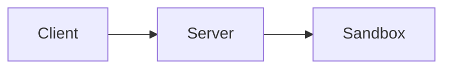

# Sandrun Documentation

This directory contains the source files for Sandrun's documentation, built using [MkDocs](https://www.mkdocs.org/) with the [Material theme](https://squidfunk.github.io/mkdocs-material/).

## Quick Start

### Prerequisites

```bash
pip install mkdocs-material mkdocs-minify-plugin
```

### Local Development

```bash
# Serve documentation locally with live reload
mkdocs serve

# Open in browser: http://127.0.0.1:8000
```

### Build Documentation

```bash
# Build static site
mkdocs build

# Output: site/ directory
```

### Deploy to GitHub Pages

```bash
# One-time deploy
mkdocs gh-deploy

# Or use automated deployment via GitHub Actions
```

## Documentation Structure

```
docs/
├── index.md                    # Homepage
├── getting-started.md          # Installation and first job
├── api-reference.md            # REST API documentation
├── job-manifest.md             # Job configuration reference
├── architecture.md             # System design and internals
├── faq.md                      # Frequently asked questions
├── security.md                 # Security guide and best practices
├── troubleshooting.md          # Common issues and solutions
│
├── integrations/               # Integration guides
│   ├── trusted-pool.md        # Pool coordinator
│   ├── broker.md              # Job broker
│   └── mcp-server.md          # Claude AI integration
│
├── development/                # Developer guides
│   ├── building.md            # Build from source
│   └── testing.md             # Testing guide
│
└── images/                     # Diagrams and screenshots
    └── (add your images here)
```

## Documentation Guidelines

### Writing Style

- Use clear, concise language
- Write in second person ("you can", not "one can")
- Use active voice where possible
- Include code examples for all features
- Add warnings for security-critical information

### Code Examples

Use syntax highlighting:

````markdown
```python
import requests
response = requests.get('http://localhost:8443/')
```
````

### Admonitions

Use Material theme admonitions for important information:

```markdown
!!! tip "Performance Tip"
    Use environment templates to avoid installing dependencies every time.

!!! warning "Security Warning"
    Always keep your kernel updated for security patches.

!!! example "Example: Submit Job"
    ```bash
    curl -X POST http://localhost:8443/submit \
      -F "files=@job.tar.gz"
    ```
```

### Tables

Use tables for structured data:

```markdown
| Feature | Value |
|---------|-------|
| CPU Quota | 10 seconds/minute |
| Memory | 512MB per job |
```

### Links

Internal links (relative):
```markdown
See the [API Reference](api-reference.md) for details.
```

External links:
```markdown
Check out [MkDocs](https://www.mkdocs.org/) for more info.
```

## Adding New Pages

1. **Create the Markdown file** in `docs/`
2. **Add to navigation** in `mkdocs.yml`:
   ```yaml
   nav:
     - New Page: new-page.md
   ```
3. **Test locally**: `mkdocs serve`
4. **Commit and push**

## Using Diagrams

### Mermaid Diagrams

Mermaid is supported out of the box:

````markdown

````

### Static Images

1. Add images to `docs/images/`
2. Reference in Markdown:
   ```markdown
   
   ```

See the repository root for `DIAGRAM_SUGGESTIONS.md` with diagram ideas.

## Configuration

Documentation configuration is in `mkdocs.yml`:

- **Theme settings**: Material theme customization
- **Navigation**: Page ordering and structure
- **Plugins**: Search, minify, etc.
- **Extensions**: Markdown extensions enabled

## Testing Documentation

### Check for Broken Links

```bash
# Build in strict mode (fails on warnings)
mkdocs build --strict

# Check for broken links
find docs/ -name "*.md" -exec grep -H "](.*)" {} \; | grep "http"
```

### Preview on Mobile

```bash
# Serve on all interfaces
mkdocs serve -a 0.0.0.0:8000

# Access from mobile on same network
# http://<your-ip>:8000
```

## Automated Deployment

Documentation is automatically deployed via GitHub Actions on push to `master`.

See `.github/workflows/docs.yml` for configuration.

## Versioning

To add versioned documentation:

```bash
# Install mike
pip install mike

# Deploy version
mike deploy v1.0 latest -u

# Set default version
mike set-default latest

# Deploy to GitHub Pages
mike deploy --push --update-aliases v1.0 latest
```

## SEO Optimization

- Each page has a unique title (H1)
- Use descriptive headings (H2, H3)
- Include meta descriptions in frontmatter:
  ```yaml
  ---
  description: Complete API reference for Sandrun REST endpoints
  ---
  ```
- Use descriptive link text (not "click here")

## Accessibility

- Use proper heading hierarchy (H1 → H2 → H3)
- Add alt text to images
- Ensure code examples are readable
- Test with screen readers if possible

## Contributing

To contribute to documentation:

1. **Fork the repository**
2. **Create a feature branch**: `git checkout -b docs/your-feature`
3. **Make changes** and test locally
4. **Build in strict mode**: `mkdocs build --strict`
5. **Submit pull request**

### Review Checklist

- [ ] Spelling and grammar checked
- [ ] Code examples tested and working
- [ ] Links verified (no 404s)
- [ ] Builds without warnings: `mkdocs build --strict`
- [ ] Renders correctly in browser
- [ ] Mobile-friendly (test with `mkdocs serve`)

## Getting Help

- **MkDocs Documentation**: https://www.mkdocs.org/
- **Material Theme**: https://squidfunk.github.io/mkdocs-material/
- **Markdown Guide**: https://www.markdownguide.org/

## License

Documentation is licensed under the same license as Sandrun (MIT).

---

**Happy documenting!** 📚
