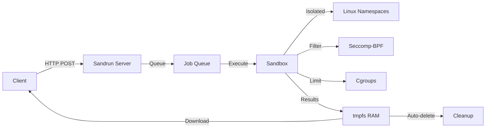

# Sandrun

> **Anonymous, ephemeral, sandboxed code execution service**

Sandrun provides secure, isolated code execution without user accounts or data persistence. Submit code, get results, everything auto-deletes. Simple, private, secure.

## What is Sandrun?

Sandrun is a **lightweight batch job execution system** that runs untrusted code in hardware-enforced isolation. Built on Linux security primitives (namespaces, seccomp-BPF, cgroups), it provides:

- **True anonymity**: No signup, no authentication, no user tracking
- **Complete isolation**: Each job runs in its own sandbox with restricted syscalls
- **Automatic cleanup**: All data lives in RAM and auto-deletes after use
- **Fair resource sharing**: IP-based rate limiting prevents abuse while ensuring access
- **Multi-language support**: Python, JavaScript, Bash, Ruby, R, and more
- **Production-ready**: Distributed execution via pool coordinator, signed results, WebSocket streaming

Perfect for ephemeral compute needs, privacy-preserving analysis, untrusted code execution, and distributed batch processing.

## Key Features

### Privacy & Security
- **🔒 Hardware-enforced Sandbox** - Linux namespaces, seccomp-BPF syscall filtering, capability dropping
- **🎭 Anonymous by Design** - No accounts, no tracking, IP-based quotas only
- **💨 Memory-only Execution** - All data in tmpfs (RAM), never touches disk
- **🔐 Cryptographic Verification** - Ed25519 signatures for worker identity and result authenticity
- **🚪 No Network Access** - Jobs are completely airgapped during execution

### Developer Experience
- **🚀 Fast & Lightweight** - Native C++ implementation, <10ms startup time, minimal overhead
- **🌐 Multi-language** - Python, Node.js, Bash, Ruby, R, and more
- **📦 Multi-file Projects** - Submit tarballs with dependencies, auto-install requirements
- **⚡ Simple REST API** - Submit via HTTP POST, poll for status, download outputs
- **🎯 Pre-built Environments** - ml-basic, vision, nlp, data-science templates with common packages

### Scalability & Integration
- **🔗 Pool Coordinator** - Distribute jobs across multiple workers with health checking and load balancing
- **📡 WebSocket Streaming** - Real-time log streaming during execution
- **🤖 MCP Server Integration** - Give Claude and other LLMs safe code execution capabilities
- **📊 Job Broker** - SQLite-backed job queue for distributed compute

## Quick Start

### Installation

```bash
# Install dependencies
sudo apt-get install libseccomp-dev libcap-dev libssl-dev

# Build
cmake -B build
cmake --build build

# Run server (requires root for namespaces)
sudo ./build/sandrun --port 8443
```

### Submit Your First Job

```bash
# Create a simple Python script
echo 'print("Hello, Sandrun!")' > hello.py

# Package and submit
tar czf job.tar.gz hello.py
curl -X POST http://localhost:8443/submit \
  -F "files=@job.tar.gz" \
  -F 'manifest={"entrypoint":"hello.py","interpreter":"python3"}'

# Response:
# {"job_id":"job-abc123","status":"queued"}

# Check status
curl http://localhost:8443/status/job-abc123

# Get logs
curl http://localhost:8443/logs/job-abc123
```

## Use Cases

### For Individuals
- **Privacy-Preserving Analysis** - Process sensitive data without leaving traces
- **Testing Untrusted Code** - Run code from the internet safely in isolation
- **Quick Prototyping** - Execute code snippets without local environment setup
- **Learning & Education** - Experiment with code in a safe sandbox

### For Teams & Organizations
- **Distributed Batch Processing** - Scale compute across multiple workers
- **CI/CD Pipeline Integration** - Execute test suites or build jobs in isolated environments
- **Anonymous Job Submission** - Process user-submitted code without authentication overhead
- **Multi-tenant Compute** - Provide code execution as a service with strong isolation

### For AI & LLM Integration
- **AI Code Execution** - Let LLMs like Claude execute code safely via MCP protocol
- **Data Analysis Workflows** - Enable AI assistants to run pandas, numpy, or R code
- **Automated Testing** - LLMs can test their own generated code

## Real-World Examples

!!! example "Quick Python Script"
    ```bash
    # Create a simple analysis script
    echo 'import statistics; print(statistics.mean([1,2,3,4,5]))' > analyze.py

    # Package and submit
    tar czf job.tar.gz analyze.py
    curl -X POST http://localhost:8443/submit \
      -F "files=@job.tar.gz" \
      -F 'manifest={"entrypoint":"analyze.py","interpreter":"python3"}'

    # Output: {"job_id":"job-abc123","status":"queued"}
    ```

!!! example "Multi-file ML Project"
    ```bash
    # Project structure:
    # project/
    # ├── train.py
    # ├── model.py
    # ├── data.csv
    # └── requirements.txt

    tar czf project.tar.gz -C project .
    curl -X POST http://localhost:8443/submit \
      -F "files=@project.tar.gz" \
      -F 'manifest={
        "entrypoint":"train.py",
        "interpreter":"python3",
        "requirements":"requirements.txt",
        "outputs":["model.pkl","metrics.json"],
        "timeout":600,
        "memory_mb":1024
      }'
    ```

!!! example "Real-time Log Streaming"
    ```javascript
    // Watch logs in real-time via WebSocket
    const ws = new WebSocket('ws://localhost:8443/logs/job-abc123/stream');
    ws.onmessage = (event) => {
      console.log(event.data);  // Prints logs as they happen
    };
    ```

## Architecture Overview



**Core Components:**

- **HTTP Server**: Minimal C++ HTTP/1.1 server with multipart upload support
- **Job Queue**: FIFO queue with IP-based rate limiting and priority handling
- **Sandbox**: Linux namespace isolation with seccomp syscall filtering
- **Resource Manager**: Cgroup-based CPU/memory limits with automatic enforcement
- **Worker Identity**: Ed25519 cryptographic signing for result verification
- **Pool Coordinator**: Distributed job routing across trusted worker nodes

[Learn more about the architecture →](architecture.md)

## Security Model

!!! warning "Security Boundaries"
    Sandrun provides strong isolation for **untrusted code execution** but relies on the Linux kernel. Always run on updated systems with kernel security patches.

**What Sandrun Protects Against:**
- Filesystem access outside the sandbox
- Network access from jobs
- Process interference between jobs
- Memory disclosure between jobs
- Persistence of job data after completion

**What Sandrun Does NOT Protect Against:**
- Kernel vulnerabilities (keep your kernel updated!)
- Timing attacks between concurrent jobs
- Covert channels via CPU cache timing
- Physical hardware attacks

[Read the full security model →](architecture.md#security-architecture)

## Performance Characteristics

| Metric | Value |
|--------|-------|
| **Job startup time** | <10ms |
| **Overhead per job** | <1% CPU |
| **Memory footprint** | 10MB (server) + 512MB (per job) |
| **Throughput** | 100+ jobs/second |
| **API latency** | <50ms (submit/status) |

## Next Steps

### New Users
1. [Getting Started Guide](getting-started.md) - Install, configure, and run your first job
2. [API Reference](api-reference.md) - Complete REST API documentation
3. [Job Manifest](job-manifest.md) - Configure job execution parameters

### Advanced Usage
4. [Trusted Pool](integrations/trusted-pool.md) - Distribute jobs across multiple workers
5. [MCP Server](integrations/mcp-server.md) - Give Claude AI safe code execution
6. [Job Broker](integrations/broker.md) - SQLite-backed distributed job queue

### Developers
7. [Architecture](architecture.md) - Understand the design and security model
8. [Building](development/building.md) - Compile from source and contribute
9. [Testing](development/testing.md) - Run tests and verify functionality

## Community & Support

- **GitHub**: [github.com/yourusername/sandrun](https://github.com/yourusername/sandrun)
- **Issues**: Report bugs, request features, ask questions
- **Discussions**: Share use cases and best practices
- **Contributions**: Pull requests welcome! See [CONTRIBUTING.md](https://github.com/yourusername/sandrun/blob/master/CONTRIBUTING.md)

## License

Sandrun is open source under the MIT License.

**Free to use, modify, and distribute** - See [LICENSE](https://github.com/yourusername/sandrun/blob/master/LICENSE) for details.

---

**Ready to get started?** [Install Sandrun →](getting-started.md){ .md-button .md-button--primary }
